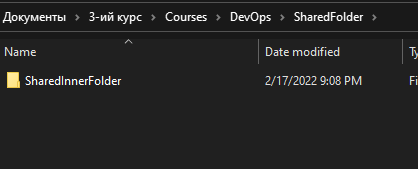
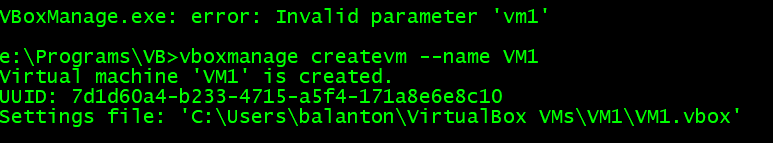
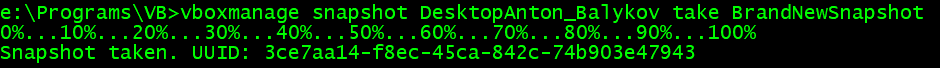

# Part 1. HYPERVISORS
## 1. What are the most popular hypervisors for infrastructure virtualization?
   - Microsoft Hyper-V
   - Red Hat KVM
   - VMware vSphere
   - Citrix XenServer
   - Oracle VirtualBox

## 2. Briefly describe the main differences of the most popular hypervisors. 
   ### Microsoft Hyper-V
   - Persistent memory support
   - Updates for shielded VMs
   - Simple two-node clusters
   - ReFS deduplication
   - Optimizing storage space handling (Storage Spaces Direct)
   - Encrypted subnets

   ### Red Hat KVM
   - Container support
   - Scalability
   - Overcommit of resources
   - Disk I/O throttling
   - Hot Swapping of Virtual Resources
   - Low Cost Virtualization Solution
   - Red Hat Enterprise Virtualization programming and API
   - Live migration and storage migration
   - Assigning any PCI devices to virtual machines
   - Red Hat Satellite Integration
   - Support for Disaster Recovery

   ### VMware vSphere
   - vCenter Server: A centralized management tool used to set up, provision and manage virtual IT environments
   - vSphere Client: vSphere 6.7 is the final release of the Flash-based vSphere Web Client. New workflows in the updated release of vSphere Client include vSphere Update Manager, content library, vSAN, storage policies, host profiles, VMware vSphere Distributed Switch topology diagram, and licensing
   - vSphere SDK: Provides interfaces for third party solutions to access vSphere
   - VM File System: A clustered file system for VMs
   - Virtual SMP: Allows a single virtual machine to use multiple physical processors at the same time
   - vMotion: live migration with transactional integrity
   - Storage vMotion: Enables migration of virtual machine files from one location to another without service interruption
   - High availability: If one server fails, the virtual machine is moved to another server with spare capacity to ensure business continuity.
   - Distributed Resource Scheduler (DRS): Automatically assigns and balances compute across the hardware resources available to virtual machines
   - Failover: Creates a copy of the main VM to ensure it is always available
   - Distributed Switch (VDS): Covers multiple ESXi hosts and greatly reduces network maintenance

   ### Citrix XenServer
   - Node recovery
   - Host failure protection
   - Multiserver management
   - Dynamic Memory Management
   - Active Directory Integration
   - Role Based Administration and Control (RBAC)
   - Mixed resource pools with CPU masking
   - Distributed virtual switch controller
   - In-memory read caching
   - Live migration of virtual machines and XenMotion storage

   ### Oracle VirtualBox
   - Snapshots of the RAM and storage that allow reverting to a prior state
   - Screenshots and screen video capture
   - "Host key" for releasing the keyboard and mouse cursor to the host system if captured (coupled) to the guest system, and for keyboard shortcuts to features such as configuration, restarting, and screenshot
   - Mouse pointer integration, meaning automatic coupling and uncoupling of mouse cursor when moved inside and outside the virtual screen, if supported by guest operating system
   - Seamless mode – the ability to run virtualized applications side by side with normal desktop applications
   - Shared clipboard
   - Shared folders through "guest additions" software
   - Special drivers and utilities to facilitate switching between systems
   - Ability to specify amount of shared RAM, video memory, and CPU execution cap
   - Ability to emulate multiple screens
   - Command line interaction (in addition to the GUI)
   - Public API (Java, Python, SOAP, XPCOM) to control VM configuration and execution
   - Nested paging for AMD-V and Intel VT (only for processors supporting SLAT and with SLAT enabled)
   - Limited support for 3D graphics acceleration (including OpenGL up to (but not including) 3.0 and Direct3D 9.0c via Wine's Direct3D to OpenGL translation)
   - Ability to mount virtual hard disk drives and disk images
   - SATA disk hotplugging
   - Pass-through mode for solid-state drives
   - Can disable host OS I/O cache
   - PATA, SATA, SCSI, SAS, iSCSI, floppy disk controllers

# Part 2. Work with VirtualBox
## Launching Ubuntu

## Interacting with VM's

## Configuring USB and Shared Folder
  
  
  
  
  
  
  

---
## Network modes:
| Mode | VM -> Host | VM <- Host | VM1 <-> VM2 | VM -> Net/LAN | VM <- Net/LAN> |
|---|:-:|:-:|:-:|:-:|:-:|
| NAT             | + | Port forward | - | + | Port forward |
| NAT Network     | + | Port forward | + | + | Port forward |
| Bridged adapter | + |       +      | + | + |       +      |
| Host-only       | + |       +      | + | - |       -      |
| Internal        | - |       -      | + | - |       -      |  
---

## Working with CLI through VBoxManage

