# Task 2.2

## Ex. 4
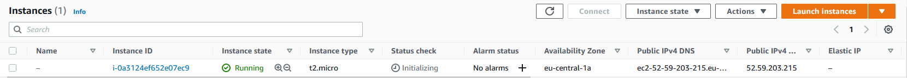  
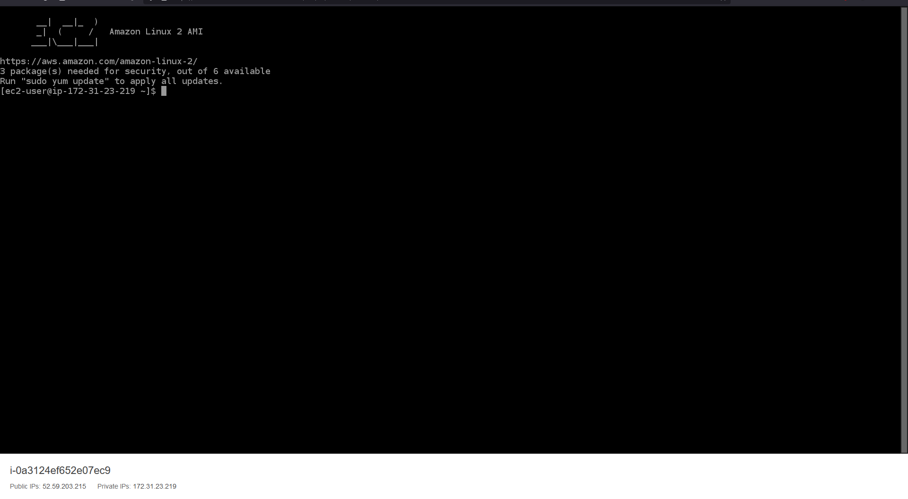  
  

## Ex. 5
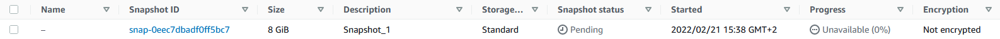

## Ex. 6-8
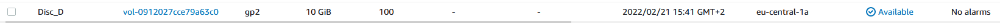
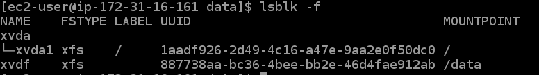
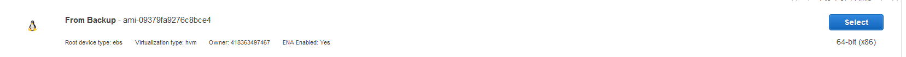
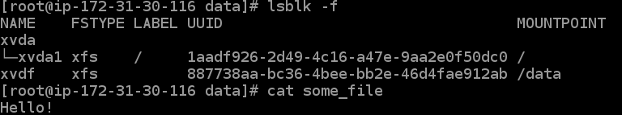

## Ex. 9
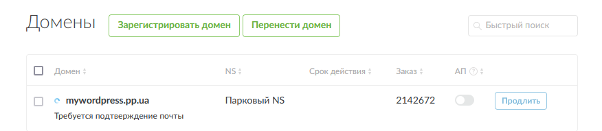

## Ex. 10
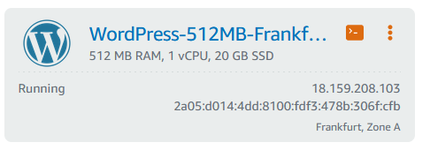
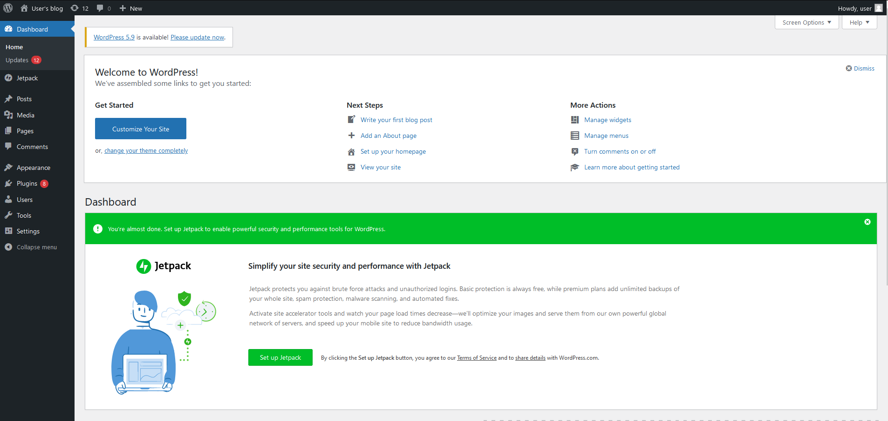
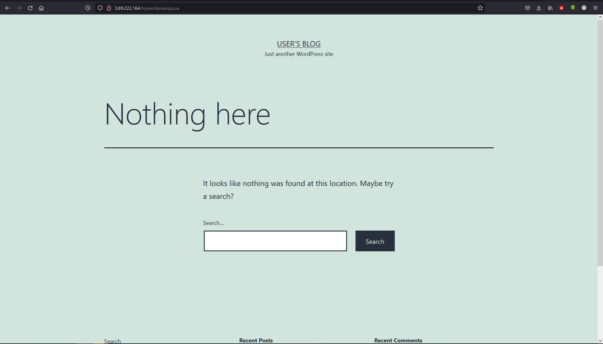

## Ex. 11
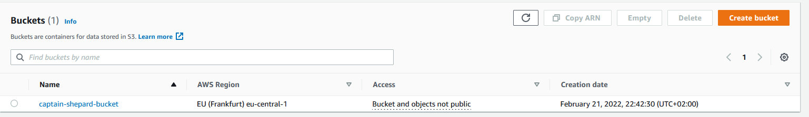
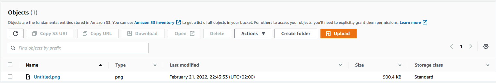
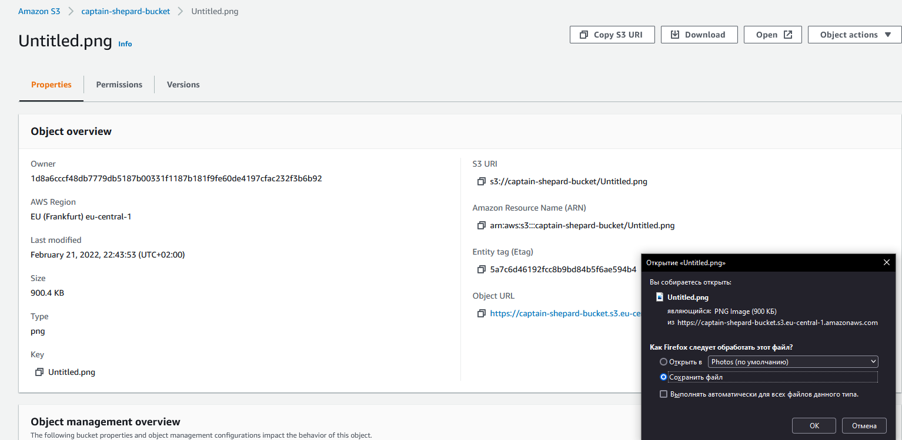

## Ex. 12
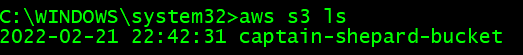
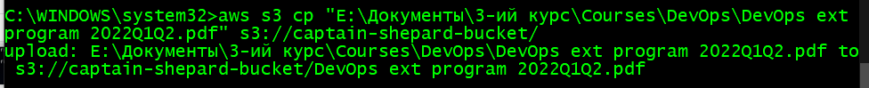
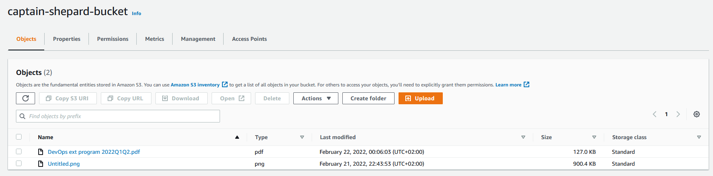

## Ex. 13
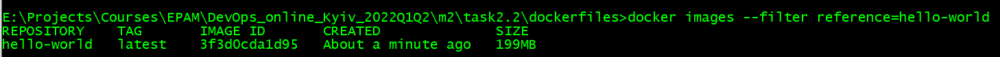

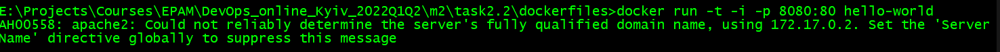
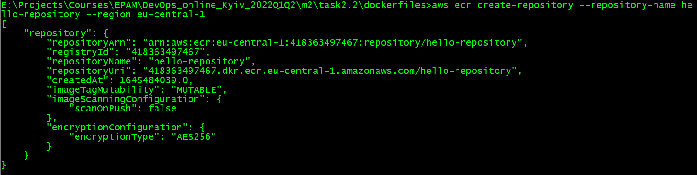
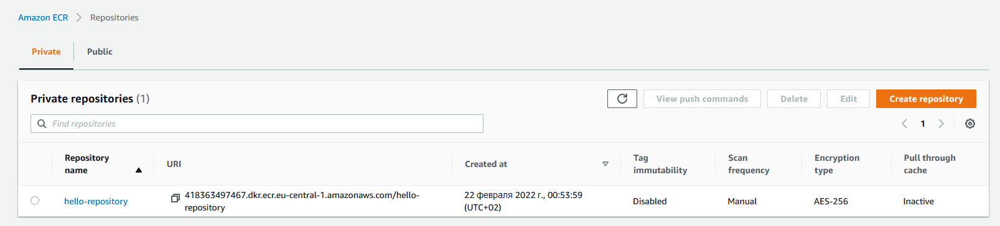

## Ex. 14
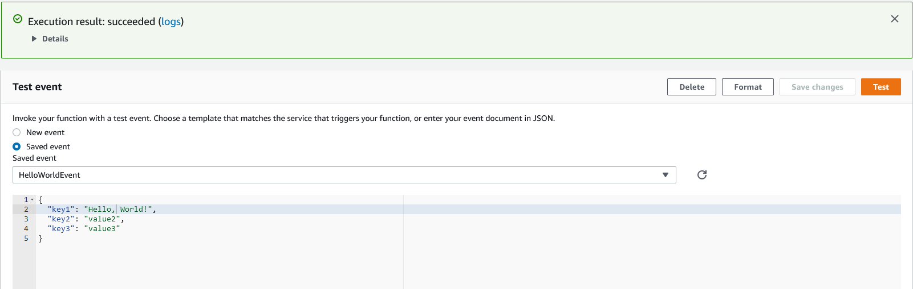
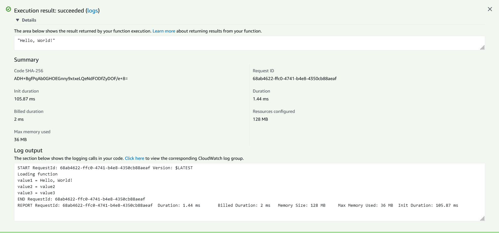

## Ex. 15
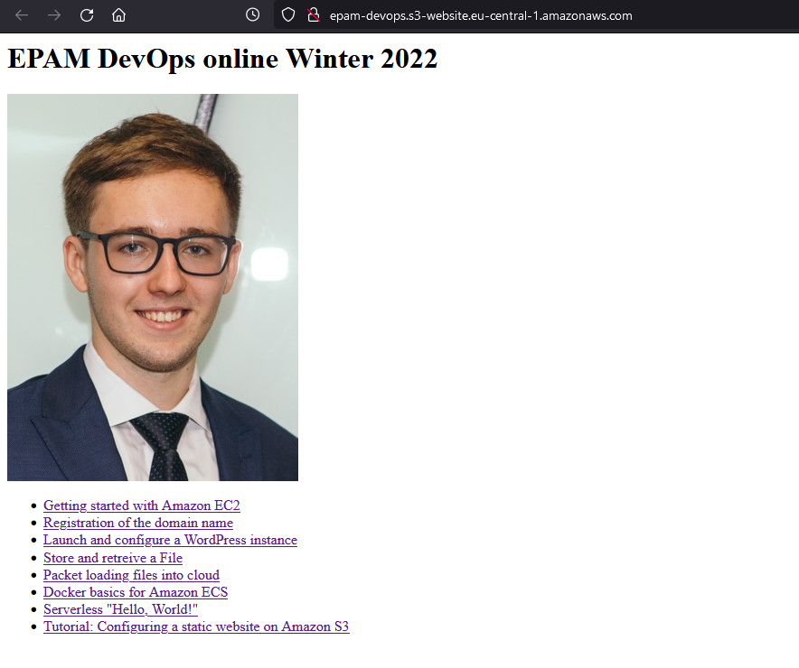  
[Static website](http://epam-devops.s3-website.eu-central-1.amazonaws.com/)
