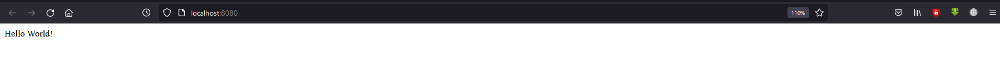

# Task 2.2

## Ex. 4
  
  
  

## Ex. 5

## Ex. 6-8

## Ex. 9

## Ex. 10

## Ex. 11

## Ex. 12

## Ex. 13

## Ex. 14

## Ex. 15
  
[Static website](http://epam-devops.s3-website.eu-central-1.amazonaws.com/)
