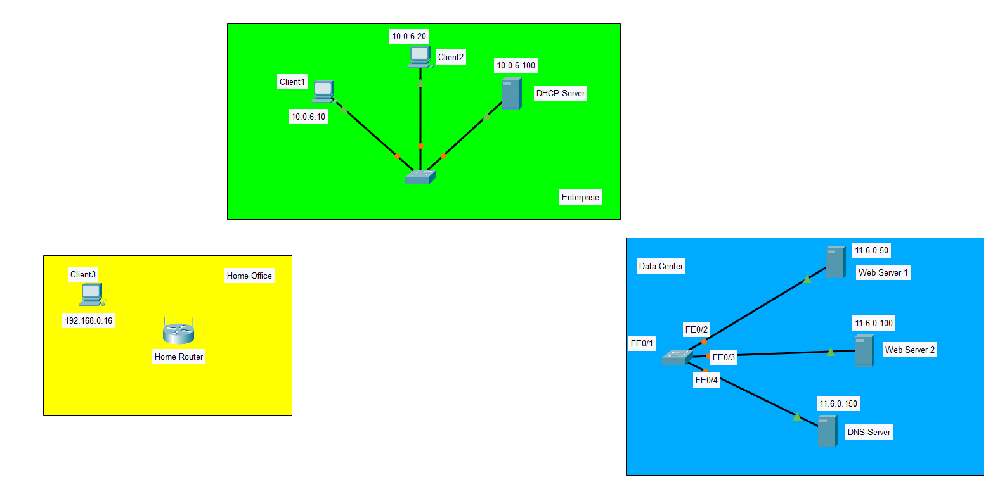
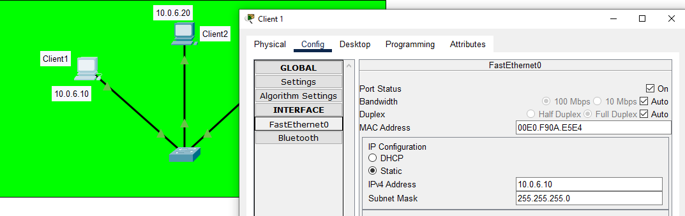
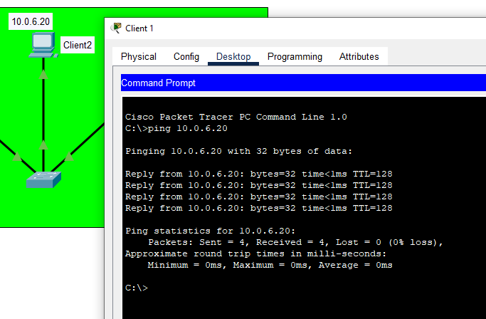
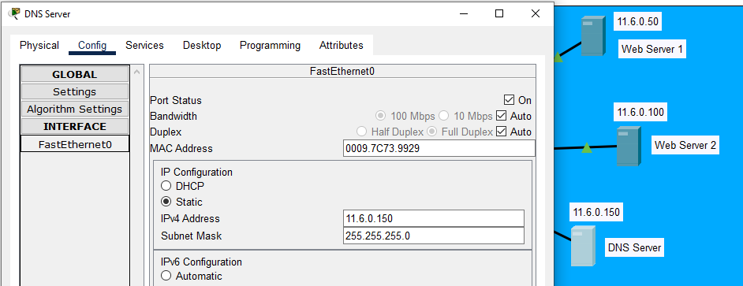
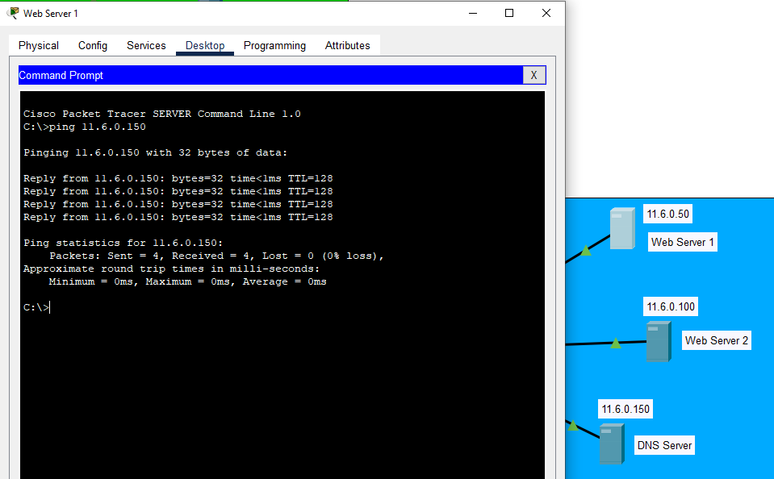
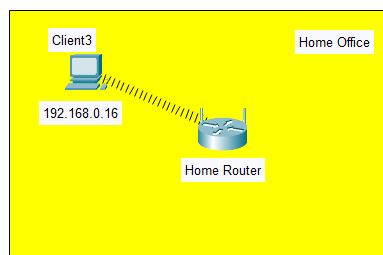
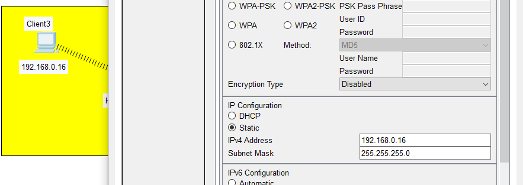
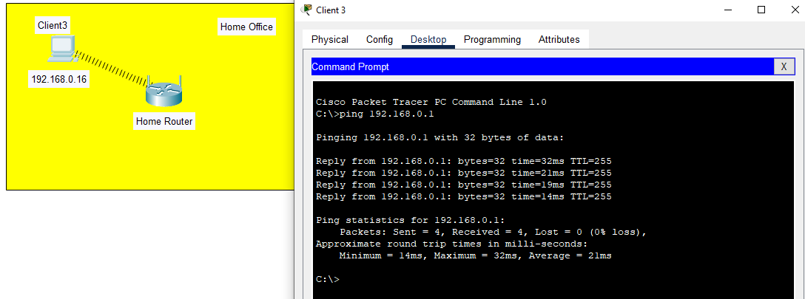
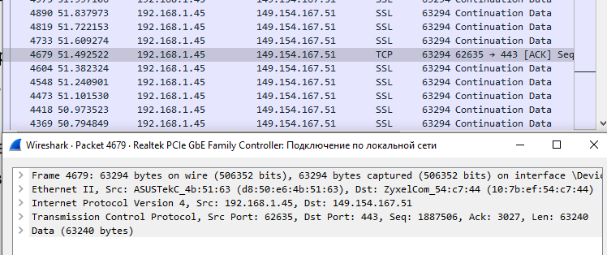
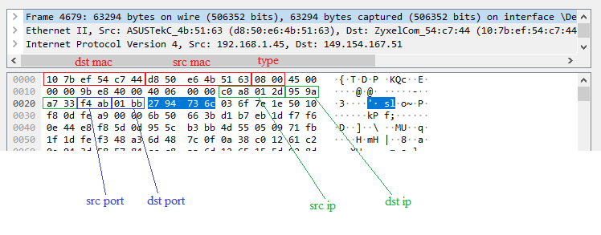

# Task 3.1

## Ex. 1
Створив мережі за прикладом

## Ex. 2
Налаштував статичні адреси в Enterprise

## Ex. 3
Перевірив за допомогою команди `ping` з Client 1 до Client 2

## Ex. 4
Налаштував статичні адреси в Data Center

## Ex. 5
Перевірив за допомогою команди `ping` з Web Server 1 до DNS Server

## Ex. 6
На  комп’ютері  Client  3  замінив  мережевий  адаптер  Ethernet  на  адаптер Wi-Fi  –  модуль  PT-HOST-NM-1W

## Ex. 7
Призначив Client 3 статичну адресу

## Ex. 8
Перевірив зв'язок з маршрутизатором за допомогою команди `ping 192.168.0.1`

# Додаткове завдання: Дослідження структури пакету за допомогою аналізатора пакетів Wireshark. 

## ТСР-сегмент

## Заголовки канального, мережевого і транспортного рівнів

MAC-адреса відправника: d8:50:e6:4b:51:63  
MAC-адреса отримувача: 10:7b:ef:54:c7:44  
IP-адреса відправника: 192.168.1.45  
IP-адреса отримувача: 149.154.167.51  
TCP-порт відправника: 62635   
TCP-порт отримувача: 443  
