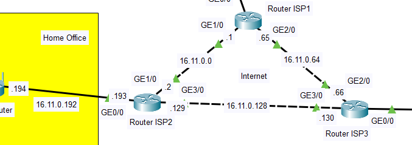
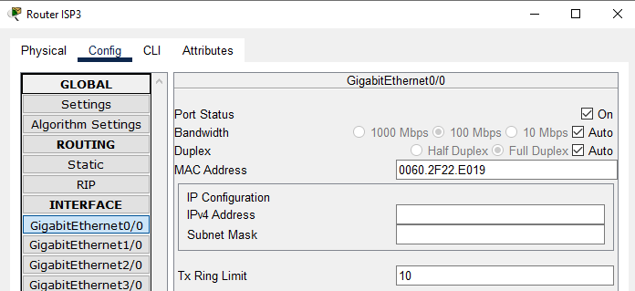

# Task 3.2

## Ex. 1
Додав маршрутизатори та налаштував їх інтерфейси  

## Ex. 2
Реалізував мережу Internet  

## Ex. 3
Призначення IP-адрес інтерфейсам маршрутизаторів  

  
  

## Ex. 4
Default Gateway на комп'ютерах  

## Ex. 5
Перевірка зв'язку комп’ютерів з власними шлюзами за допомогою команди `ping` (з Client 2)  

## Ex. 6
`ping` та `tracert` в Data Center  

## Ex. 7
Змінив маску підмережі на серверах на 255.255.255.192  

## Ex. 8
`tracert` з Web Server 1 до Web Server 2 і 3  

Now packets go through Router ISP3 because Web Server 1 and Web Server 2 are in different subnets and Switch can not forward packets while Router can.   

## Ex. 9
Зміна VLAN Switch Data Center   

## Ex. 10
`ping` DNS Server з Web Server 1  

Не проходить, оскільки Router ISP3 не вміє перенаправляти тегований трафік між різними VLAN  

## Ex. 11 -> 12

## Ex. 13

## Ex. 14

## Ex. 15

## Ex. 16
`ping` DNS Server з Web Server 1
