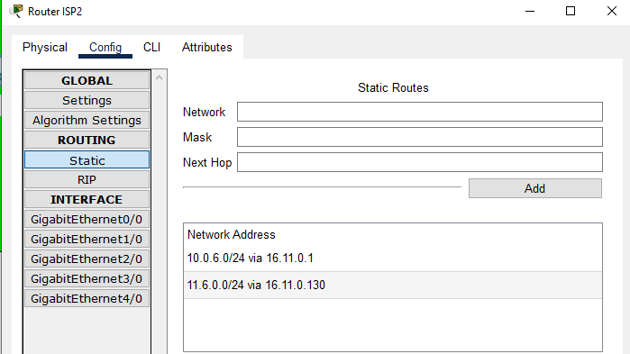
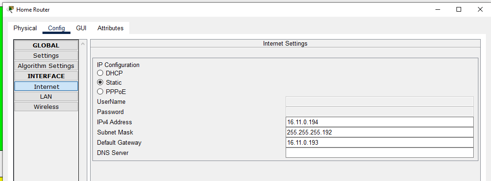
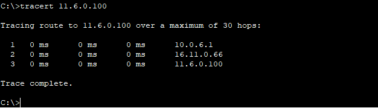
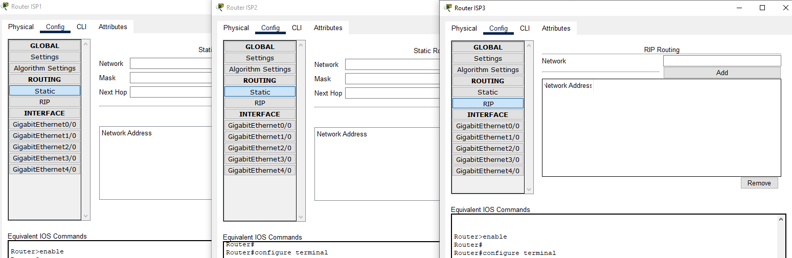
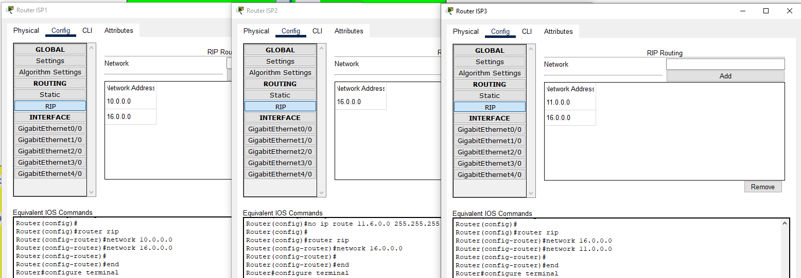
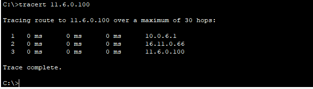

# Task 3.3

## Ex. 1
Налаштував таблиці маршрутизації, на прикладі Router ISP2

## Ex. 2
Налаштував маршрутизацію на Home Router

## Ex. 3
`tracert` з Client 2 на Web Server 2

## Ex. 4
Видалив статичні записи з таблиць маршрутизації ISP1, ISP2 та ISP3

## Ex. 5
На  маршрутизаторах ISP1,  ISP2  та  ISP3  налаштував  протокол  RIP

## Ex. 6
`tracert` з Client 2 на Web Server 2
