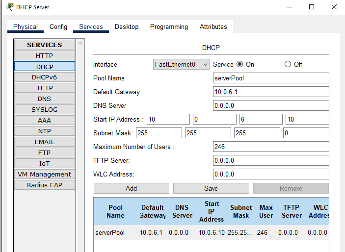
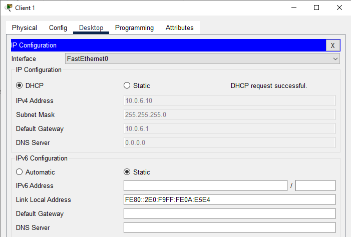
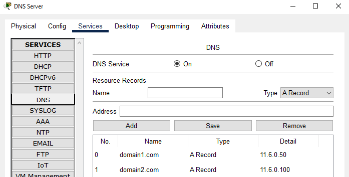
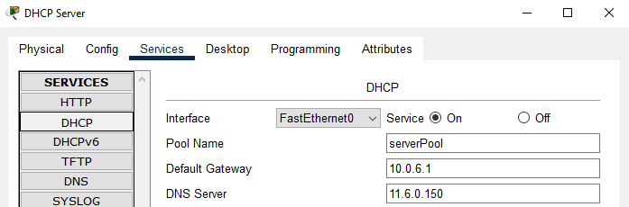
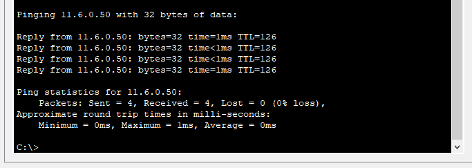
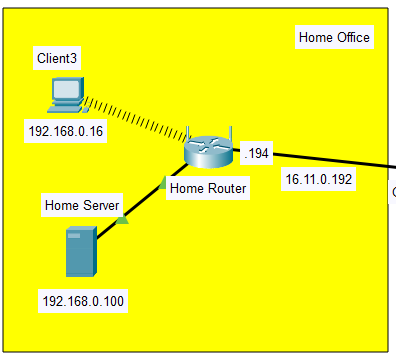
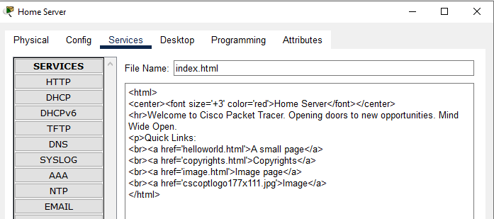
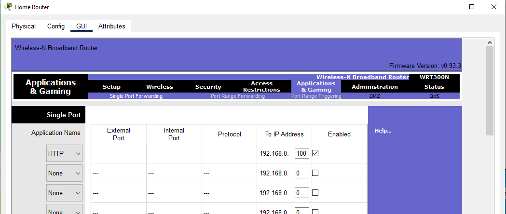
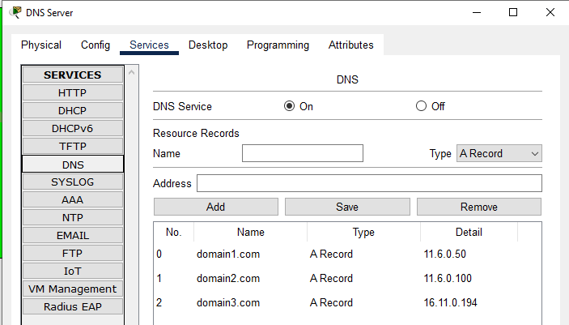
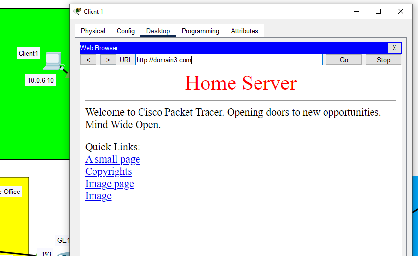

# Task 3.4

## Ex. 2
Зробив  налаштування  DHCP  Pool  

## Ex. 3
Перевірив працездатність сервісу, поставивши в налаштуваннях  Client 1 та Client 2 DHCP  

## Ex. 6
Вніс відповідні записи в налаштування DNS сервера  

## Ex. 7
Додав  до  налаштувань  DHCP  серверів  адресу  DNS  сервера  та  оновити налаштування на клієнтах  

## Ex. 8
Перевірив працездатність шляхом відправки ping з Client на доменне ім’я  

## Ex. 9
Додав  в  мережу  Home  Office  Home  Server  та  призначити  йому  статичну адресу  

## Ex. 10
На  Home  Server  для  HTTP  сервісу  відкоригував  index.html  

## Ex. 11
Налаштував Port Forwarding на Home Router  

## Ex. 12
Додав на DNS Server запис для Home Server  

## Ex. 13
Перевірив  працездатність  шляхом  уведення  на  Client1  у  Desktop/Web Browser - `domain3.com`  
